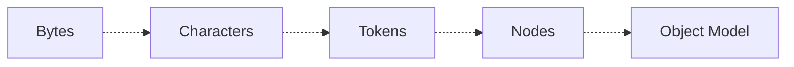
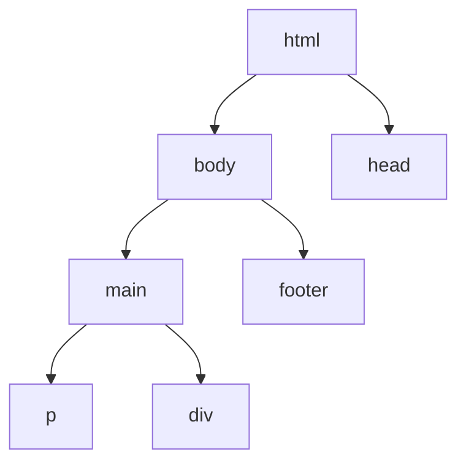
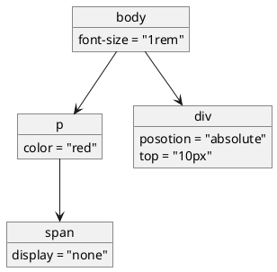
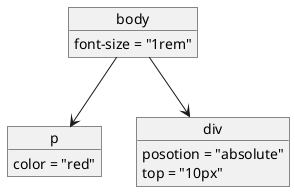
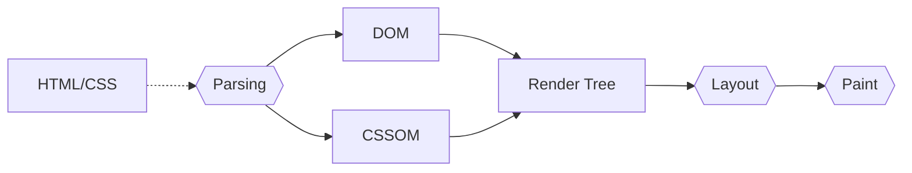

---
# try also 'default' to start simple
theme: bricks
# random image from a curated Unsplash collection by Anthony
# like them? see https://unsplash.com/collections/94734566/slidev
background: https://source.unsplash.com/collection/94734566/1920x1080
# apply any windi css classes to the current slide
class: 'text-center'
# https://sli.dev/custom/highlighters.html
highlighter: shiki
# show line numbers in code blocks
lineNumbers: true
colorSchema: 'dark'
# some information about the slides, markdown enabled
info: |
  ## Slidev Starter Template
  Presentation slides for developers.

  Learn more at [Sli.dev](https://sli.dev)
# persist drawings in exports and build
drawings:
  persist: false
---

# CSS Houdini

Deep dive into browser APIs

<!--
The last comment block of each slide will be treated as slide notes. It will be visible and editable in Presenter Mode along with the slide. [Read more in the docs](https://sli.dev/guide/syntax.html#notes)
-->

---
layout: intro
---

# About Me

<div class="about-me">

 

</div>

<br>
<br>

Read more about [Why Slidev?](https://sli.dev/guide/why)

<!--
You can have `style` tag in markdown to override the style for the current page.
Learn more: https://sli.dev/guide/syntax#embedded-styles
-->

<style>
.about-me {
display: flex;

}
h1 {
  /*background-color: #2B90B6;*/
  /*background-image: linear-gradient(45deg, #4EC5D4 10%, #146b8c 20%);*/
  /*background-size: 100%;*/
  /*-webkit-background-clip: text;*/
  /*-moz-background-clip: text;*/
  /*-webkit-text-fill-color: transparent;*/
  /*-moz-text-fill-color: transparent;*/
}
</style>

---

# List of Content

1. Rendering process in Browsers
   - Parsing
   - Render tree
   - Layout
   - Paint
1. CSS Houdini
    - Typed OM
    - Properties and Values
    - Paint API
  
---
layout: intro
---

# How does browsers render CSS?

---

# Rendering Engine


---

# 1. Parsing

<br/><br/>
<br/><br/>
<br/><br/>

<div class="text-center">



</div>


---
layout: two-cols
---
## DOM

<br/><br/>



::right::

## CSSOM

<br/><br/>



---
layout: items
cols: 2
preload: false
---
# 2. Render tree

::items::

<div
   v-motion 
   :initial="{ opacity: 1, x: 0, transition: { duration: 3000 } }"
   :enter="{ opacity: 0, x: 20, transition: transition}"
>


</div>


<div 
   v-motion 
   :initial="{ opacity: 1, x: 0, transition: { duration: 3000 } }"
   :enter="{ opacity: 0, x: -20, transition: transition}"
>


</div>


<div
   style="position: absolute; left: 50%; transform: translateX(-50%)"
   v-motion 
   :initial="{ opacity: 0, transition: { duration: 2000 } }"
   :enter="{ opacity: 1, transition: {...transition, delay: 1000}}"
>



</div>

<script setup lang="ts">
const transition = {
    type: 'spring',
    damping: 10,
    stiffness: 20,
    mass: 2,
  } 
</script>

---
layout: section
---
# Layout
Reflow

::right::


---
layout: section
---
# Paint
Rasterizing

::right::


---

# Rendering flow

<br/><br/>
<br/><br/>

<div class="text-center">


</div>

---

<br/><br/>

## Setting Values

```js
el.style.transform = `translate(${xValue}px, ${yValue}px);`;

```

<br/>
<br/>
<br/>

## Getting Values

```js
el.style.fontSize

// '2rem'
```

---
layout: intro
---

# Enters Houdini...

---
layout: section
---

# Extensible Web Manifesto

::right::

The main idea of this manifesto is to move the focus from creating high-level APIs to providing low-level APIs and expose the underlying layers.

---
layout: section
---

# CSS Houdini...

::right::

- An umbrella term for a group of low-level APIs that are coming as a result of Extensible Web Manifesto applied to CSS
- It is going to enable developers to have access to every phase of the rendering process and extend its behaviour


---
layout: section
---

# Typed OM


::right::

It is an upgraded alternative for old string based CSSOM. 
- It’ll add types to css values in the form of JavaScript objects.
- On top of that it will provide a set of semantic APIs that makes working with CSS in JavaScript more pleasant

---

# Typed OM


<div class="mt-30">


### With CSSOM:
```ts
const fontSize = getComputedStyle(box).getPropertyValue("font-size");

// 16px
```
</div>


---

# Typed OM


### With the new TypedOM

```ts
const fontSize = box.computedStyleMap().get("font-size");
```
<br />


---
layout: fact
---

# Demo
[Code Sandbox](https://codesandbox.io/s/naughty-dijkstra-glz1jy?file=/src/typed-om.js)

---

# Properties & Values API

### Javascript

```ts{all|2|3|4|5|all}
CSS.registerProperty({ 
  name: '--my-color',
  syntax: '<color>', 
  inherits: false,
  initialValue: 'pink',
});
```


<br />

### CSS

```css
@property --my-color {
  syntax: '<color>';
  inherits: false;
  initial-value: pink;
}
```

<div class="text-center">

[CodeSandbox](https://codesandbox.io/s/naughty-dijkstra-glz1jy?file=/src/styles.css)

</div>

---
layout: section
---

# Worklets

::right::


<div v-click>

Worklets are independent scripts that run during the rendering process.
- They run by the rendering engine
- They are thread-agnostic

</div>

<div v-click>

Houdini has introduced three worklets:
- Pain Worklet or Paint API
- Animation Worklet or Animation API
- Layout Worklet  or Layout API

</div>

---
layout: two-cols
---

# Paint API

<br/><br/>

<v-clicks>

1. Register the worklet by a name using `registerPaint`
2. Add the script module in HTML or JS file:
   ```js
   CSS.paintWorklet.addModule('worklet.js')
   ```
3. Use it in CSS with
   ```css
   background: paint(worklet_name)
   ```


</v-clicks>


::right::

<v-click>


### A Paint Worklet

```js{all|1,17,19,20|6,7,12-16|8|9|10,2|11,3|all}
class ImagePainter {
  static get inputProperties() { return ["--myVariable"]; }
  static get inputArguments() { return ["<color>"]; }
  static get contextOptions() { return {alpha: true}; }

	// The only mandatory method
  paint(
      ctx, // CanvasRenderingContext2D
      size, // The geometry of the painting area
      properties, // List of custom propertes
      args // List of arguments passed to paint(..)
  ) {
    
      // Painting logic
      
  }
}

// Register our class under a specific name
registerPaint('my-image', ImagePainter);
```

</v-click>


